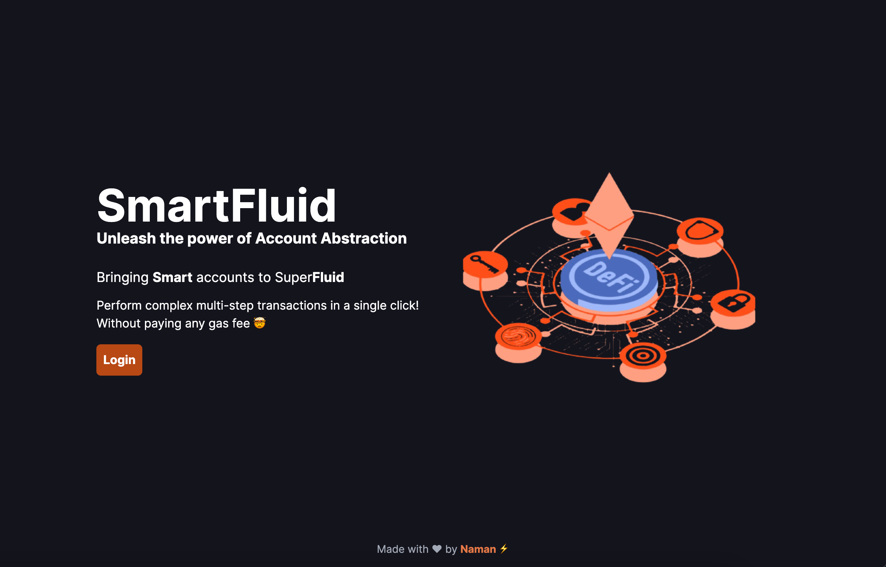
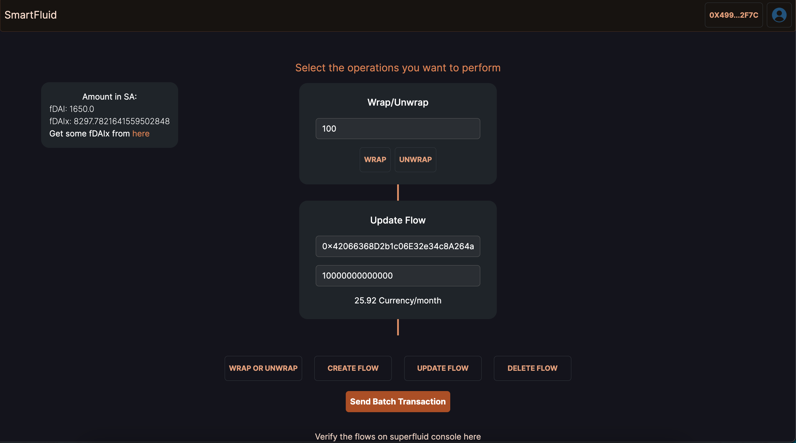

# SmartFluid

The aim is to provide one-click UX for Superfluid users by using Biconomy SDK.

## Description

SmartFluid is a web app that provides one-click UX for Superfluid users. It is built using Nextjs and Biconomy SDK. The user can perform any combination of the following operations in a single click

Currently SmartFluid supports the following operations of Superfluid:

1.  Wrap and Unwrap
2.  Create flow
3.  Update flow
4.  Delete flow

To understand more about Superfluid and its operations, please refer to the [Superfluid documentation](https://docs.superfluid.finance/superfluid/developers/constant-flow-agreement-cfa).

To understand more about Biconomy and its operations, please refer to the [Biconomy documentation](https://docs.biconomy.io/).

Right now the defult token is set to fDAI. To perform any "flow" operation we have to first perform the "wrap" operation to make it a "Super token". This is because the flow operations are only supported on Super tokens.

## Demo

Batch merge, create flow, update flow and delete flow tx hash [here](https://mumbai.polygonscan.com/tx/0x627e37fffe2fa43a14d59b9f67624f833e08ec11c7d5a8fb40a7ebb9641864a3)




## Getting Started

### Dependencies

- NPM or Yarn
- Get some fDAIx (Super Fake DAI) from [here](https://docs.superfluid.finance/superfluid/developers/super-tokens/super-token-faucet)

### Installing

- I have made my Gas tank API key and Quicknode key public for the purpose of the demo but will me removed soon. If you want to use your own keys, please follow the steps below:

1.  Create a .env file in the root directory of the project.
2.  Add the following keys to the .env file:

```
NEXT_PUBLIC_DAPP_API_KEY =
NEXT_PUBLIC_RPC_URL =
```

3.  Replace the values of the keys with your own keys.

### Executing program

```
git clone https://github.com/namn-grg/smart-fluid.git
```

```
cd smart-fluid
```

```
yarn install
```

```
yarn dev
```

## Help

Make sure you are passing the correct arguments. Eg

1. If you are trying to create a flow, make sure you have wrapped the token first.
2. If you are trying to update a flow, make sure you have created a flow first.
3. If you are trying to delete a flow, make sure you have created a flow first.
4. If you are trying to unwrap a token, make sure you have wrapped the token first.
5. If you are trying to wrap a token, make sure you have unwrapped the token first.
6. Pass the correct address of the receiver
7. Dont try to batch crazy number of operations as every block has a gas limit. If you are trying to batch a lot of operations, you might get an error.
8. Error "Call gas estimation failed" is prolly because of one of the above reasons

## Authors

Naman Garg [@namn-grg](https://twitter.com/namn_grg)

## License

This project is licensed under the [NAME HERE] License - see the LICENSE.md file for details
